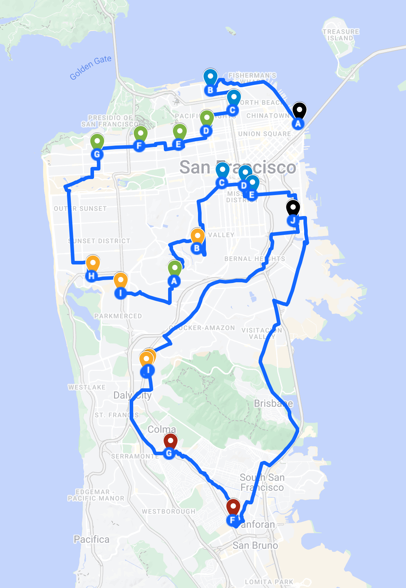

I’m a huge fan of alleycats (unsanctioned bike races inspired by bike messengers, where riders choose their routes to complete checkpoints in open traffic). You get handed a manifest and part of the fun is picking a smarter, shorter route than your competition, so even though maybe you’re worse in raw power/speed, you still have a chance at beating your opponent.

Recently I and a bunch of other [Cakers](http://fatcake.cc/) raced in the [Supermarket Street Sweep](https://supermarketstreetsweep.com), a charity race that benefits the [SF-Marin Food Bank](https://www.sfmfoodbank.org). Racers receive a manifest that looks something like this:


The ride starts at Cupid’s Span in The Embarcadero. At each intermediate grocery store, you buy packs of pasta and shove them into your backpack / bags mounted on your bike. Then, you deliver the goods to the SF-Marin Food Bank at 900 Pennsylvania Avenue. And it’s a 4 hour race—you get the manifest at 12 noon and the cutoff is 4pm.

Our strategy on the day of was as follows:
1. Take a photo of the manifest
2. Use the text recognition feature built into the Apple Photos app to grab all the text
3. Ask ChatGPT to normalize all of the addresses (e.g. adding the words “San Francisco, CA” to every address that didn’t have a city)
4. Plug the list of addresses into my [TSP Solver](https://daylen.com/tsp), which is just a UI shim over the [Google Maps Directions API](https://developers.google.com/maps/documentation/directions/get-directions) but with `optimize:true` so that the waypoints are reordered.

That strategy yielded the following ordering:



The problem, of course, was that it was impossible to get this route done within 4 hours, given that at each grocery store we had to stop, shop, and checkout, averaging 5-7 minutes per store (but actually 20 minutes at Foods Co in the Mission, grr). And also, I had wildly underestimated just how much pasta we would be buying (and how voluminous pasta is!). I had to make a mid-ride stop at home to get a bigger backpack, and we ended up not nabbing any of the high value grocery stores in Daly City, San Bruno, or South San Francisco. So [this is what our route ended up being](https://www.strava.com/activities/12864030644). Nonetheless, at 240 points, Emily and I still came in 3rd and 2nd respectively in our categories (yay!). In the FTWNB category, first place had scored 260 points, while in the open/men’s category, first place did 240 points but 30 minutes faster than me.

Naturally I was totally nerdsniped and wondered how to do better. The 260 point result in the FTWNB category proved that it was possible to get more points.

Normal TSP treats every node as the same, and visiting each node is mandatory. This is a variable-reward TSP with optional node visits (and also, an optional volume constraint). This seemed like something that could be formulated as an integer linear program, but I was too lazy to actually write all the constraints. So I gave [O1](https://openai.com/index/introducing-openai-o1-preview/) this prompt:


> I have the following optimization problem which is a combination of TSP and knapsack, with constraints:
>
> - We have a graph with nodes and edges. We must start at node S and end at node E.
> - Time constraint: There is a max budget of N hours within which we must get from S to E. Each edge represents travel time. Additionally, upon arriving at a node, we must stay there for M minutes.
> - Volume constraint: At each node we must pick up a small item or a large item. The volume is either V1 or V2. We have a bag with a maximum volume. Picking up the item is mandatory to claim the points for the node.
> - Maximizing: Each node has a point value associated with it. Point values vary between nodes, and are specified. We receive the point value if we have picked up the item for that node.
> - We want to print out the best ordering of node visits.
>
> How would I set up this problem in CBC? Give me python code.


O1 actually gave me a fairly decent starting point. After manually constructing the graph of travel times by entering all pairs of addresses into Google Maps bicycling directions (yes, I did [spend an hour doing this](https://gist.github.com/daylen/1451fbd422552ebe97ccf7d73ec88b6e#file-supermarket_opt-py-L31-L206)), next up was a bunch of back-and-forth debugging with O1. CBC kept alternating between giving me nonsense results and just hanging, which was a bit frustrating. A couple notes:

* O1 pointed out that I had edges going from the end node to grocery stories, which was a bit nonsensical because the end node is the end. So I had to [strip those out](https://gist.github.com/daylen/1451fbd422552ebe97ccf7d73ec88b6e#file-supermarket_opt-py-L213-L217).
* I eventually just gave up and switched to a different solver, thinking that maybe this problem (19 nodes, 307 edges) was too complicated for CBC. I switched to [OR-Tools](https://developers.google.com/optimization) and asked O1 to rewrite everything with that API. It thought for 32 seconds and then spat out perfectly functional OR-Tools code!

But OR-Tools was *still* hanging! I couldn’t believe it. I let it chew on the problem for a couple minutes and then hit `Ctrl + C`. That’s when OR-Tools spat out a solution. I realized that maybe the solvers were struggling to prove that they had found the globally optimal solution, but were finding a “good enough” solution fairly quickly. Once again, O1 to the rescue: “Yes, the CP-SAT solver in OR-Tools allows you to print out intermediate solutions as it progresses. This can be achieved by implementing a custom solution callback that gets called each time the solver finds a new feasible solution.”

Now we were cooking. By adjusting the Google Maps multiplier (I find Google Maps bicycling directions to be a bit slow), time spent at each node, and max volume variables, I was able to explore the solution space of winning strategies. I ended up liking this 280 point proposal which seemed doable (and you can cut out the last couple 10 pointers if you’re running low on time):


The interesting thing about this route is that you spend the first ~hour just hammering down to the first store, and you totally skip the Richmond / Marina stores. Here are the arrival times at each node, accounting for shopping time:

```
Arrival time 0 minutes Node start 
Arrival time 63 minutes Node lucky_40 
Arrival time 82 minutes Node gross_out_40 
Arrival time 101 minutes Node smart_and_final_30 
Arrival time 109 minutes Node lucky_dc_30 
Arrival time 130 minutes Node tj_30 
Arrival time 141 minutes Node lucky_30 
Arrival time 160 minutes Node safeway_20 
Arrival time 180 minutes Node safeway_30 
Arrival time 207 minutes Node whole_foods_10 
Arrival time 217 minutes Node foods_co_10 
Arrival time 225 minutes Node gus_10 
Arrival time 240 minutes Node end
```

[Full code](https://gist.github.com/daylen/1451fbd422552ebe97ccf7d73ec88b6e) (dependency on [OR-Tools](https://developers.google.com/optimization))

So anyway, see you at next year’s race :)
